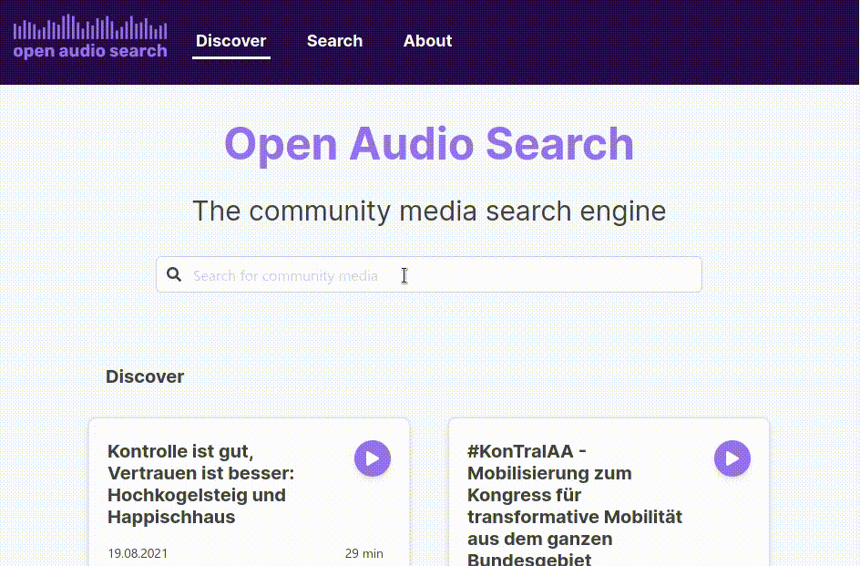

# Open Audio Search

## Motivation

Open Audio Search is a search engine for audio. It uses automated speech recognition to turn spoken word into text, which allows regular search engines to find results directly on the speech content of radio features or podcasts.

We have a background in community media networks. While commercial solutions exist, those are usually out of reach for community radios or other non commercial media outlets: A pricing by the minute for the speech transcription is unfeasable. While some open source tools are availble for e.g. speech recognition or full-text search, they are usually hard to setup and are not integrated, requiring much manual effort to get to any useful results.

At the same time, there are several large repository of interesting and important audio files, radio features, podcasts readily availalbe under free licenses. A good example are the [community broadcasting archive](https://cba.fro.at) or [freie-radios.net](https://freie-radios.net). On these platforms, there is a lot of great content archived, but oftenly hard to find: Especially for volunteer-run outlets, there's usually not much time for adding descriptions and metadata after something is done - and even more so for content from 20 years ago.

With Open Audio Search, we want to tackle these issues and help to create a maintainable and future proof open-source platform for community media. We want to use state-of-the-art technologies and so-called artifical intelligence to make content from non-mainstream media discoverable. We hope to be able to empower community media creators to increase their reach and audience: If content does not disappear after a show is played, but is part of a living and easily browsable archive, things don't get lost as quickly as they currently often tend to.

## Where we are

After being accepted into the 9th round of the Prototype fund, we spend the last six months sketching ideas, implementing a backend (twice), a responsive web user interface and a speech recognition worker, and creating a setup for the future of Open Audio Search as an open source project.

And today, we are ready to launch our first public demo:

### [demo.openaudiosearch.org](https://demo.openaudiosearch.org)

This site currently indexes some recent posts from [cba](https://cba.fro.at) and [freie-radios.net](https://freie-radios.net). Read below for more details, and please beware: This is an alpha release and contains bugs and missing features. Feel invited to report any issues or ideas on our [GitHub issue tracker](https://github.com/openaudiosearch/openaudiosearch/issues/new/choose)!

## Features

Open Audio Search currently is at its first Alpha release, with a first Beta coming soon. As of today, it has the following features implemented and usable:

* Ingest RSS feeds from any source and save them to the local database
* Automatically download and transcribe all audio files references in the RSS feeds
* Customize the mapping of metadata fields of the RSS items onto a shared internal data model
* Full-text search over both metadata and automatically created transcripts
* Responsive web user interface that allows to play the media files and search and filter all indexed data
* When the search yields results from a transcript, the UI allows to jump the player right to the position of the search result within an audio file
* Authentication for the HTTP API and a way for administrators to add and manage indexed RSS feeds through the web UI.

## Experiences

In the six months of the Prototype fund, we designed, planned and implemented this first version of Open Audio Search from the ground-up.

We started with a proof-of-concept backend written in Python. This worked out well, but soon we realized that while we all could write Python well enough for a proof of concept, it was not the language we wanted to use for a stable and maintained production version of the Open Audio Search backend. Therefore, around half-time of the Prototype fund, we decided to move the backend to [Rust](https://www.rust-lang.org/), a language empowering everyone to build reliable and efficient software. At the same time, we settled for our current stack of services used in OAS: [CouchDB](https://couchdb.org) as our primary data store and [Elasticsearch](https://www.elastic.co/) for the search index. Moving the backend to Rust proved to be challenging and rewarding at the same time: The initial implementaiton took a while, but turned out to be very reliable already in early stages and allows us to iterate and refactor without fear.

At the same time, we continously developed the frontend, switching between creating mockups, implementing them in our [React](https://reactjs.org)-based single page application and fixing bugs and packaging issues.

From the start we tried to provide a smooth onboarding and packaging experience. We have a continous integration setup that produces new [Docker](https://www.docker.com/) container images after each commit. This makes it easy and straightforward to run your own instance of Open Audio Search.

Two features that we intended to start implementing during the Prototype fund had to be moved a bit further down the way. Through natural language processing, we want to automatically extract keywords and tags from the transcripts for categorization and better search. While we have a minimal proof-of-concept setup for NLP and NER setup included in OAS, this will need some further tuning and development to produce actually useful results. We also want to allow to connect OAS cores over a peer-to-peer network to sync databases between different instances. We have some sketches ready, but did not move this into the main package yet. By making use of the [built-in replication feature of CouchDB](https://docs.couchdb.org/en/main/replication/intro.html), this will be rather straightforward to finalize.

An open source project does not only consist of writing source code. Initially, we struggled with going public and organizing the non-technical parts of the project. This improved a lot during the last six months. We now have READMEs and issue templates on our [GitHub repo](https://github.com/openaudiosearch/openaudiosearch), a public [Discord server](https://discord.openaudiosearch.org) and improved our internal project managment significantly. The workshop with Simon from [zero360](https://zero360.de/en/) that was part of the Prototype program was very fruitful. We started to use Miro boards more and gave better organization to our weekly meetings. Jumping the hurdles to actually do some structured project managment and brainstorming proved to be rewarding.

## Future plans

We now have a working setup, as can be seen through our [demo](https://demo.openaudiosearch.org). For the future, we have a few plans already in the pipeline:

- With out partners from [cba](https://cba.fro.at) and [freie-radios.net](https://freie-radios.net) we want to launch a production instance of Open Audio Search for German-language community media in the next months.

- Through a sibling project supported by [netidee](https://www.netidee.at/) we will setup a training and evaluation pipeline of our own to improve the speech recognition. We will also move the NLP processing forward to produce meaningful results by matching against a knowledge base like [Wikidata](https://www.wikidata.org/wiki/Wikidata:Main_Page).

- Sometime next year we want to implement a replication system between OAS nodes. This is the next step towards our goal of creating a rich content network for community media across Europe. With support from the [European Cultural Foundation](https://culturalfoundation.eu/) and partners in Ireland and Spain we want to launch a first pilot of this [*european cultural backbone*](https://ecb-preview.arso.xyz/) in the forseeable future.

We invite anyone interested in creating better discoverability of community media to get in contact with us! For technical details feel free to open issues on our [GitHub repo](https://github.com/openaudiosearch/openaudiosearch). For other comments, ideas or potential collaborations please come by our [Discord server](https://discord.openaudiosearch.org) or [send us an email](mailto:info@arso.xyz).

## Technical architecture

The following paragraphs will outline the technical architecture of Open Audio Search. This is directed to developers and system administrators and may include technical terms without too much explanation. The architecture document is also included in our [Github repo](https://github.com/openaudiosearch/openaudiosearch), where we intend to expand and improve it. Please feel free to open issues there if things are unclear!

### Core (or backend)

This is a server daemon written in [Rust](https://rust-lang.org). It provides a REST-style HTTP API and talks to our main data services: [CouchDB](https://couchdb.org) and [Elasticsearch](https://www.elastic.co/) or [OpenSearch](https://opensearch.org/).

The core compiles to a static binary that includes various sub commands, the most important being the `run` command which runs all parts of the core concurrently. The other commands currently mostly serve debug and adminstration purposes.

The core oftenly uses the [`_changes`](https://docs.couchdb.org/en/stable/api/database/changes.html) endpoint in CouchDB. This endpoint returns a live-streaming list of all changes to the CouchDB. Internally, CouchDB maintains a log of all changes made to the database, and each revision is assigned a sequence string. Various services in OAS make use of this feature to visit all changes made to the database.

We now give an overview of the services that run within OAS core:

* HTTP API: The HTTP API is powered by [Rocket](https://rocket.rs/), a HTTP framework for Rust. It provides a REST-style API that allows to `GET`, `POST`, `PUT` and `PATCH` the various data records in OAS (feeds, posts, medias, transcripts, ...). It also manages authentication for the routes. It can serve the web frontend either by statically including the HTML, JavaScript and other assets directly in the binary, or by proxying to another HTTP server (useful for development).

* Indexer: The indexer service listens on the CouchDB changes stream and indexes all posts, medias and transcripts into an Elasticsearch index. For the index, our data model is partially flattened to make querying straightforward.

* RSS importer: The RSS importer also listens on the changes stream for *Feed* records and then periodically fetches these RSS feeds and saves new items into *Post* and *Media* records. It also sets a flag on the *Media* records depending on the settings that are part of the *Feed* record whether a transcribe job is wanted or not.

* Job queue: The job service also listens on the changes stream and may, depending on a *TaskState* flag, create jobs for the worker. The job services currently uses the [Celery](https://docs.celeryproject.org/en/stable/getting-started/introduction.html) job queue with a [Redis](https://redis.io/) backend.

### Worker

The worker is written in Python. It currently uses the [Celery](https://docs.celeryproject.org/en/stable/) job queue to retrieve jobs that are created in the core. It performs the jobs and then posts back its results to the core over the HTTP API exposed by the core. Usually, it will send a set of JSON patches to update one or more records in the database with its results.

Currently, the two main tasks are:

* `transcribe`: This task takes an audio file, downloads and converts it into a WAV file and then uses the [Vosk](https://alphacephei.com/vosk/) toolkit to create a text transcription of the audio file. Vosk is based on [Kaldi ASR](https://kaldi-asr.org/), an open-source speech-to-text engine. To create these transcripts, a model for the language of the audio is needed. At the moment, the only model that is automatically used in OAS is the German language model from the Vosk model repository. We will soon provide more models, and will then also need to implement a mechanism to first detect the spoken language to then use the correct model.

* `nlp`: This task takes the transcript, description and other metadata of a post as input, and then performs various NLP (natural language processing) steps on this text. Most importantly, it tries to extract keywords through an NER (named entity recognition) pipeline. Currently, we are using the [SpaCy](https://spacy.io/) toolkit for this task.

* `punctuation_reconstruction` (TODO: Not yet implemented). This task will take a transcript as its input and then will use a neural network model to restore punctuation in the transcript task (the ASR engine only returns words, no punctuation). We will likely use [punctuator2](https://github.com/ottokart/punctuator2) for this task.

### Frontend

The frontend is a single-page web application written with [React](https://reactjs.org/). It uses the [Chakra UI](https://chakra-ui.com/) toolkit for various components and UI elements. The frontend talks to the core through its HTTP API. It is mostly public-facing with a dynamic search page that allows filtering and faceting the search results. We currently use [ReactiveSearch](https://github.com/appbaseio/reactivesearch) components for the search page. It also features a login form for administrators, which unlocks administrative sections. Currently, this only includes a page to manage RSS feeds and some debug sections. We will add more administrative features in the future.

### Packaging

OAS includes [Dockerfiles](https://docs.docker.com/engine/reference/builder/) for the core and the worker to easily package and run OAS as Linux containers. It also includes [docker-compose](https://docs.docker.com/compose/) files to easily start and run OAS together with all required services: CouchDB, Elasticsearch and Redis.

The docker images can be built from source with the provided Dockerfiles. We also push nightly images to Dockerhub, which allows to run OAS without building from source.
